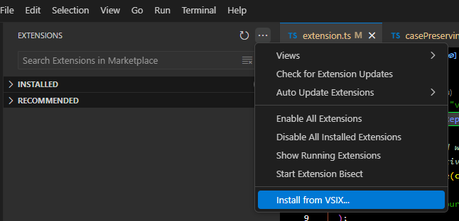
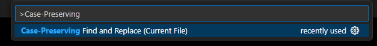

# case-preserving-find-and-replace README

Privide similiar functionality with Visual Studio's
[case-preserving-find-and-replace](https://devblogs.microsoft.com/visualstudio/keep-your-casing-with-case-preserving-find-and-replace/).

## Features

When search term is "begin", replace term is "end":

- begin -> end,
- Begin -> End,
- BEGIN -> END

When search term is "fourfivesix", replace term is "fourFiveSix":

- fourfivesix -> fourfivesix,
- fourFiveSix -> fourFiveSix,
- FourFiveSix -> FourFiveSix,
- fourFiveSIX -> fourFiveSIX

- Not support case:
  - FourFiveSix -> FOURFiveSix (Actual: -> FourFiveSix)
  - FourFIVESIX -> FOURFiveSIX (Actual: -> FourFIVESIX)

## Release Notes

### 0.0.1

Currently, there's no way to create a widget similar to the native
find and replace widget, which limits its usability.
Therefore, it will be not released and only for personal use.

### To install it locally:

```
npm install --global vsce

vsce package
```

Then install the generated file:
\<project root directory\>/case-preserving-find-and-replace-0.0.1.vsix
into local VS Code:



### To use it in VS Code:

Open the command palette by pressing (`Ctrl+Shift+P` or `Cmd+Shift+P` on Mac),
and type `Case-Preserving Find and Replace (Current File)` in the search box:



The program will prompt you for a Search Term and a Replace Term,
one after the other. Enter each term and press Enter.
The text will then be replaced accordingly.
